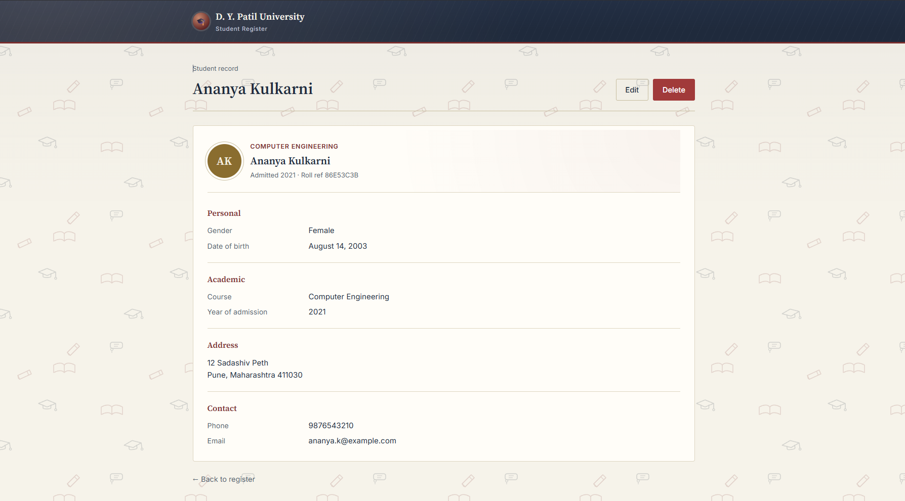
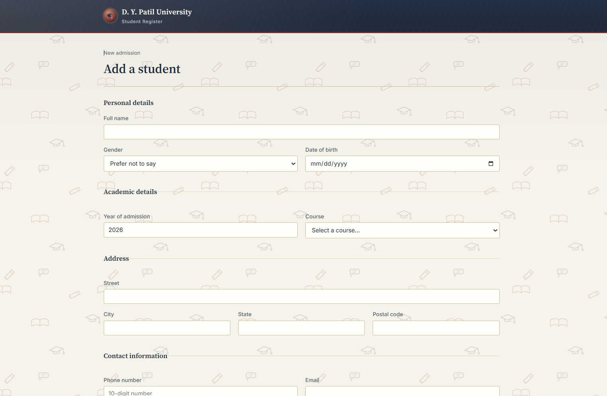

# Student Register

A React + TypeScript app for managing student records: create, read, update, and
delete students, with search, sorting, filtering, and pagination.

## Photos





## Features

- **Student fields**: name, gender, date of birth, year of admission, course
  (dropdown), address (street/city/state/postal code), phone and email.
- **CRUD**: add a student, view a paginated & searchable list, edit a record,
  delete with a confirmation dialog.
- **List view**: search by name, filter by course or year of admission, sort by
  name / course / year of admission.
- **Detail view**: dedicated route (`/students/:id`) showing the full record.
- **Validation**: required fields, email format, 10-digit phone, postal code
  format — inline error messages, submit is blocked until valid.
- **State management**: React Context API + `useReducer`, persisted to
  `localStorage` so data survives a page refresh.
- **TypeScript** throughout, strict mode on.

## How it works

**State management.** All student data lives in one place: `StudentContext.tsx`,
built with React's Context API + `useReducer` instead of prop-drilling or a
third-party library like Redux. A reducer takes an action (`ADD`, `UPDATE`,
`DELETE`, `RESET`) and returns the new list of students; any component can
read that list or dispatch a change via the `useStudents()` hook. It's synced
to `localStorage` on every change, so refreshing the page doesn't lose data —
there's no backend here, the browser *is* the database.

**Routing = screens.** Four routes (`/`, `/students/new`, `/students/:id`,
`/students/:id/edit`) map directly to the four things a user does: browse,
create, view, edit. The `:id` in the URL is what makes the detail and edit
pages "know" which student they're looking at.

**Validation is decoupled from UI.** `validateStudent()` in `utils/validation.ts`
is a plain function with no React in it — given a draft student, it returns an
object of error messages. `StudentForm.tsx` calls it on submit and blocks
saving until it comes back empty. Keeping it separate means the rules are easy
to point to and easy to unit-test on their own.

**Why Context instead of Redux.** For a single-entity CRUD app like this, a
reducer + Context gives the same predictable, action-based state updates
Redux does, without the extra dependency and boilerplate (store setup,
slices, providers). If this app grew — multiple related entities, complex
derived state, time-travel debugging — Redux Toolkit would earn its place;
here it would be overhead.

**Design decisions.** TypeScript is strict-mode throughout so a typo in a
field name or a wrong type fails at compile time, not at runtime. The UI
avoids external image dependencies (no CDN photos) — the avatars and hero
illustration are generated/embedded SVG, so the app looks the same whether
you're online or not.

## Getting started

```bash
npm install
npm run dev
```

Then open the printed local URL (typically http://localhost:5173).

## Build

```bash
npm run build   # type-checks and produces a production build in dist/
npm run preview # serve the production build locally
```

## Project structure

```
src/
  types/student.ts        Student, Address, ContactInfo types + course/gender lists
  context/StudentContext.tsx   Context + reducer for global student state (localStorage-backed)
  utils/validation.ts     Form validation rules
  components/
    StudentList.tsx       Search, filter, sort, paginate, delete
    StudentForm.tsx        Add / edit form with validation
    StudentDetail.tsx      Full record view (route-based "detail modal")
    ConfirmDialog.tsx      Reusable delete confirmation dialog
  App.tsx                  Routes
  main.tsx                 Entry point (BrowserRouter + StudentProvider)
```

## Notes

- Sample data is seeded on first run; everything after that is stored in your
  browser's `localStorage` under the key `student-management:students`. Clear
  your browser storage (or edit the seed data in `StudentContext.tsx`) to reset.
- Swapping the Context/reducer for Redux Toolkit would mean replacing
  `StudentContext.tsx` with a slice + store, and swapping `useStudents()` for
  `useSelector`/`useDispatch` — the components themselves wouldn't need to change
  much since they only call `addStudent` / `updateStudent` / `deleteStudent`.
